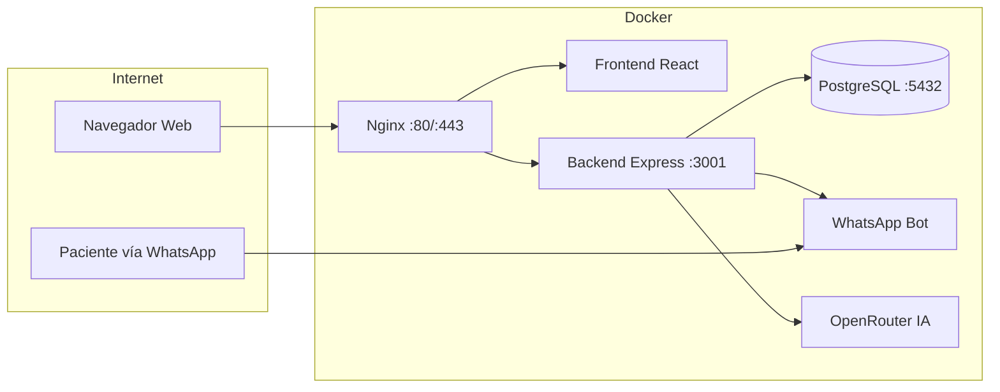
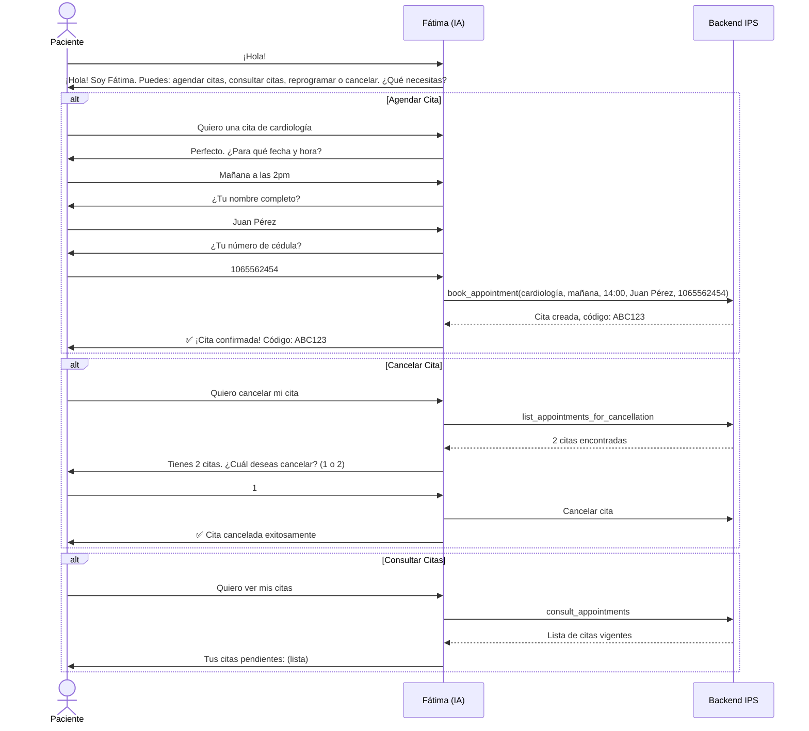
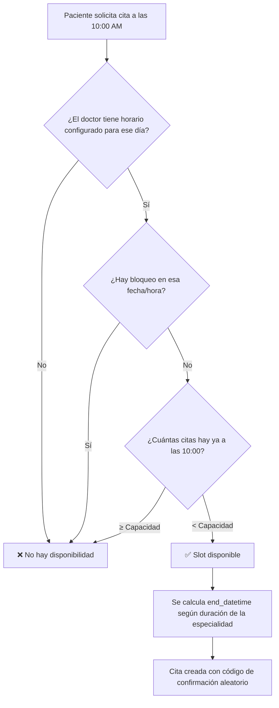

# 📋 Manual de Usuario Integral — Sistema de Gestión IPS Nuestra Señora de Fátima

> **Versión:** 2.0  
> **Última actualización:** Marzo 2026  
> **Plataforma:** `portal.ipsnuestrasenoradefatima.com`

---

## Índice General

1. [Introducción y Arquitectura del Sistema](#1-introducción-y-arquitectura-del-sistema)
2. [Acceso al Sistema — Pantalla de Login](#2-acceso-al-sistema--pantalla-de-login)
3. [Roles de Usuario — Descripción Exhaustiva](#3-roles-de-usuario--descripción-exhaustiva)
4. [Usuarios Pre-insertados y Datos Semilla](#4-usuarios-pre-insertados-y-datos-semilla)
5. [Panel de Administrador (ADMIN)](#5-panel-de-administrador-admin)
6. [Panel del Médico (DOCTOR)](#6-panel-del-médico-doctor)
7. [Panel de Recepción / Atención al Cliente (RECEPTIONIST)](#7-panel-de-recepción--atención-al-cliente-receptionist)
8. [Panel de Laboratorio (LAB)](#8-panel-de-laboratorio-lab)
9. [Portal del Paciente (PATIENT)](#9-portal-del-paciente-patient)
10. [Asistente Virtual de WhatsApp — Fátima](#10-asistente-virtual-de-whatsapp--fátima)
11. [Sistema de Calendario Inteligente](#11-sistema-de-calendario-inteligente)
12. [Sistema de Notificaciones Automáticas](#12-sistema-de-notificaciones-automáticas)
13. [Módulo de Reportes y Estadísticas](#13-módulo-de-reportes-y-estadísticas)
14. [Manejo de Errores y Solución de Problemas](#14-manejo-de-errores-y-solución-de-problemas)
15. [Infraestructura y Despliegue (Docker)](#15-infraestructura-y-despliegue-docker)
16. [Glosario de Estados de Citas](#16-glosario-de-estados-de-citas)
17. [Preguntas Frecuentes (FAQ Técnico)](#17-preguntas-frecuentes-faq-técnico)

---

## 1. Introducción y Arquitectura del Sistema

El sistema IPS Nuestra Señora de Fátima es una plataforma médica integral compuesta por **tres partes principales** trabajando en sincronía:

| Componente | Tecnología | Puerto | Descripción |
|---|---|---|---|
| **Frontend (Panel Web)** | React + Vite + TailwindCSS | `80/443` (Nginx) | Interfaz visual para todos los roles |
| **Backend (API REST)** | Node.js + Express | `3001` | Lógica de negocio, autenticación, API |
| **Base de Datos** | PostgreSQL 15 | `5432` | Almacenamiento persistente |
| **Bot de WhatsApp** | whatsapp-web.js + Puppeteer | Integrado en backend | Asistente virtual "Fátima" con IA |
| **Motor de IA** | OpenRouter API (Step 3.5 Flash) | Externo | Procesamiento de lenguaje natural |



### Seguridad

- **Autenticación:** JWT (JSON Web Token) con expiración de **24 horas**.
- **Contraseñas:** Encriptadas con `bcrypt` (salt de 10 rondas).
- **Autorización:** Middleware por roles — cada ruta del API verifica que el usuario tenga el rol correcto.
- **Interceptor Axios:** Si el token expira (error `401`), el usuario es redirigido automáticamente al login.

---

## 2. Acceso al Sistema — Pantalla de Login

### URL de Acceso
```
https://portal.ipsnuestrasenoradefatima.com/login
```

### Iniciar Sesión (Todos los roles)

1. Ingrese su **usuario** en el campo "Usuario".
2. Ingrese su **contraseña** en el campo "Contraseña".
3. Puede hacer clic en el ícono del ojo 👁 para mostrar/ocultar la contraseña.
4. Presione **"Iniciar Sesión"**.
5. El sistema lo redirigirá automáticamente al panel correspondiente a su rol:

| Rol | Ruta de Destino |
|---|---|
| ADMIN | `/` (Panel Administrativo completo) |
| DOCTOR | `/doctor` |
| RECEPTIONIST | `/receptionist` |
| LAB | `/lab` |
| PATIENT | `/patient` |

### Registro de Pacientes (Auto-registro)

Los pacientes pueden crear su propia cuenta haciendo clic en **"Registrarse como Paciente"** en la pantalla de login.

**Campos del formulario de registro:**

| Campo | Obligatorio | Descripción |
|---|---|---|
| Usuario | ✅ Sí | Nombre de usuario único para iniciar sesión |
| Email | ❌ No | Correo electrónico |
| Contraseña | ✅ Sí | Mínimo 6 caracteres |
| Confirmar Contraseña | ✅ Sí | Debe coincidir con la contraseña |
| Nombres y Apellidos | ✅ Sí | Nombre completo legal |
| Documento (Cédula) | ❌ No | Número de identificación |
| Celular | ✅ Sí | Número de teléfono único (debe ser único en el sistema) |
| Género | ❌ No | Masculino, Femenino u Otro |
| Fecha de nacimiento | ❌ No | Formato fecha estándar |

**Errores posibles en el registro:**

| Error | Causa | Solución |
|---|---|---|
| `"El usuario ya existe"` | El nombre de usuario ya fue registrado | Elegir otro nombre de usuario |
| `"Las contraseñas no coinciden"` | Los campos contraseña y confirmar no son iguales | Verificar que ambos campos son iguales |
| `"La contraseña debe tener al menos 6 caracteres"` | Contraseña demasiado corta | Usar una contraseña más larga |

---

## 3. Roles de Usuario — Descripción Exhaustiva

El sistema maneja **7 roles** diferentes. Cada rol determina qué pantalla ve el usuario y qué acciones puede realizar:

### Tabla Maestra de Permisos

| Funcionalidad | ADMIN | DOCTOR | RECEPTIONIST | LAB | PATIENT | MANAGER | DIRECTOR |
|---|:---:|:---:|:---:|:---:|:---:|:---:|:---:|
| Ver Dashboard General | ✅ | ❌ | ❌ | ❌ | ❌ | ✅ | ✅ |
| Crear/Editar Servicios | ✅ | ❌ | ❌ | ❌ | ❌ | ❌ | ❌ |
| Crear/Editar Especialidades | ✅ | ❌ | ❌ | ❌ | ❌ | ❌ | ❌ |
| Crear/Editar Médicos | ✅ | ❌ | ❌ | ❌ | ❌ | ❌ | ❌ |
| Gestionar Horarios Médicos | ✅ | ❌ | ❌ | ❌ | ❌ | ❌ | ❌ |
| Agendar Citas (Admin) | ✅ | ❌ | ❌ | ❌ | ❌ | ❌ | ❌ |
| Ver Todas las Citas | ✅ | ❌ | ❌ | ❌ | ❌ | ❌ | ❌ |
| Ver solo MIS Citas | ❌ | ✅ | ❌ | ❌ | ✅ | ❌ | ❌ |
| Cancelar/Reprogramar Citas | ✅ | ❌ | ❌ | ❌ | ❌ | ❌ | ❌ |
| Validar Código de Asistencia | ✅ | ❌ | ❌ | ❌ | ❌ | ❌ | ❌ |
| Ver/Buscar Pacientes | ✅ | ❌ | ❌ | ❌ | ❌ | ❌ | ❌ |
| Gestionar Empleados (CRUD) | ✅ | ❌ | ❌ | ❌ | ❌ | ❌ | ❌ |
| Chat WhatsApp Manual | ✅ | ❌ | ✅ | ❌ | ❌ | ❌ | ❌ |
| Activar/Desactivar Bot por chat | ✅ | ❌ | ✅ | ❌ | ❌ | ❌ | ❌ |
| Activar/Desactivar Bot Global | ✅ | ❌ | ❌ | ❌ | ❌ | ❌ | ❌ |
| Restablecer sesión WhatsApp | ✅ | ❌ | ❌ | ❌ | ❌ | ❌ | ❌ |
| Gestionar EPS/Entidades | ✅ | ❌ | ❌ | ❌ | ❌ | ❌ | ❌ |
| Ver Reportes y Estadísticas | ✅ | ❌ | ❌ | ❌ | ❌ | ❌ | ❌ |
| Exportar Reportes (Excel/PDF) | ✅ | ❌ | ❌ | ❌ | ❌ | ❌ | ❌ |
| Subir/ver Resultados de Lab | ✅ | ❌ | ❌ | ✅ | ✅ | ❌ | ❌ |
| Eliminar Resultados de Lab | ❌ | ❌ | ❌ | ✅ | ❌ | ❌ | ❌ |
| Configurar FAQs del Chatbot | ✅ | ❌ | ❌ | ❌ | ❌ | ❌ | ❌ |
| Buzón de Sugerencias (Leer/Responder) | ✅ | ❌ | ✅ | ❌ | ❌ | ❌ | ❌ |
| Enviar Sugerencias/Quejas | ❌ | ❌ | ❌ | ❌ | ✅ | ❌ | ❌ |
| Ver FAQs del Portal | ❌ | ❌ | ❌ | ❌ | ✅ | ❌ | ❌ |
| Agendar Cita desde Portal | ❌ | ❌ | ❌ | ❌ | ✅ | ❌ | ❌ |
| Editar Mi Perfil | ✅ | ✅ | ✅ | ✅ | ✅ | ✅ | ✅ |
| Cambiar Contraseña | ✅ | ✅ | ✅ | ✅ | ✅ | ✅ | ✅ |
| Cambiar Avatar | ✅ | ✅ | ✅ | ✅ | ✅ | ✅ | ✅ |
| Tema Claro/Oscuro | ✅ | ✅ | ✅ | ✅ | ✅ | ✅ | ✅ |

---

## 4. Usuarios Pre-insertados y Datos Semilla

Al inicializar la base de datos por primera vez, el sistema inserta automáticamente los siguientes datos semilla:

### Administrador Inicial
El primer administrador se crea manualmente vía el endpoint `/api/auth/register-admin`. **Solo se puede crear UN administrador** por esta vía. Si ya existe un ADMIN en la base de datos, el endpoint devuelve error `403: "Admin already exists"`.

### Servicios Pre-cargados

| Servicio | Estado |
|---|---|
| Laboratorio Clínico | ✅ Activo |
| Medicina Especializada | ✅ Activo |
| Ecografía | ✅ Activo |
| Radiografías | ✅ Activo |
| Fisioterapia | ✅ Activo |
| Odontología | ✅ Activo |
| Enfermería | ✅ Activo |
| Medicina General | ✅ Activo |

### Entidades / EPS Pre-cargadas

| Entidad | Estado |
|---|---|
| PARTICULAR | ✅ Activa |
| ARL | ✅ Activa |
| SOAT | ✅ Activa |
| ALIANZA SALUD | ✅ Activa |
| COMPENSAR | ✅ Activa |
| MEDICINA PREPAGADA | ✅ Activa |

### Configuración Inicial

| Configuración | Valor por defecto |
|---|---|
| `is_bot_enabled` | `true` (Bot de WhatsApp activado) |

---

## 5. Panel de Administrador (ADMIN)

El Administrador tiene acceso **completo** a todo el sistema. Su panel lateral (sidebar) contiene las siguientes secciones:

### 5.1 Inicio (Dashboard)
- **Tarjetas resumen:** Total de citas, citas hoy, pacientes únicos, médicos activos.
- **Gráfico de barras:** Citas de los últimos 7 días.
- **Lista rápida:** Citas del día actual con estado, hora, paciente y médico.
- **Estado de WhatsApp:** Indicador visual del estado de conexión del bot (Conectado/Desconectado/QR/Error).
- **Controles del Bot:** Botón para activar/desactivar el bot globalmente y botón para resetear la sesión de WhatsApp.

### 5.2 Reservar (Gestión de Citas)
- **Vista de lista o calendario:** Alternar entre lista de citas y vista de calendario mensual.
- **Agendar nueva cita:** Formulario paso a paso:
  1. Buscar paciente por teléfono (o crear nuevo paciente).
  2. Seleccionar entidad (EPS, SOAT, ARL, Particular, etc.).
  3. Seleccionar régimen y número de autorización (si aplica).
  4. Seleccionar servicio y especialidad.
  5. Seleccionar médico.
  6. Seleccionar fecha y ver horarios disponibles.
  7. Confirmar la reserva.
- **Cancelar cita:** Botón rojo en la lista de citas. Envía notificación automática al paciente por WhatsApp.
- **Reprogramar cita:** Arrastrar y soltar en el calendario, o editar manualmente. Envía notificación automática al paciente.
- **Validar asistencia:** Ingresar el código de confirmación de 6 caracteres que el paciente recibió. Marca la cita como **COMPLETED**.
- **Filtro de vista:** Citas próximas / Citas pasadas.

### 5.3 Calendario
- **Vista mensual interactiva:** Cada día muestra las citas con colores de especialidad.
- **Navegación:** Flechas para ir al mes anterior/siguiente.
- **Detalle al clic:** Click en un día para ver las citas de ese día.

### 5.4 Pacientes
- **Búsqueda:** Buscar por nombre, teléfono o cédula.
- **Lista completa:** Todos los pacientes registrados con su información de contacto.
- **Ver resultados:** Enlace para ver los documentos/resultados subidos por un paciente.

### 5.5 Médicos
- **CRUD completo:** Crear, editar, activar/desactivar médicos.
- **Campos del médico:** Nombre completo, teléfono, especialidades (selección múltiple).
- **Gestión de Horarios:** Para cada médico:
  - **Horarios regulares:** Definir día de la semana, hora de inicio, hora de fin y especialidad.
  - **Horarios especiales (fechas específicas):** Para cubrir días específicos diferentes a la agenda regular.
  - **Bloqueos/Vacaciones:** Definir fechas con rango de horas en las que el médico NO atiende.

### 5.6 Empleados
- **Crear nuevo empleado:** Formulario con usuario, contraseña, rol y nombre completo.
- **Roles disponibles para creación:** DOCTOR, RECEPTIONIST, LAB, MANAGER, DIRECTOR.
- **Vincular médico:** Si el rol es DOCTOR, se debe seleccionar el registro de médico a vincular (campo `reference_id`).
- **Activar/Desactivar:** Toggle para habilitar o deshabilitar el acceso de un empleado sin eliminarlo.
- **Lista de empleados:** Muestra todos los usuarios del sistema excluyendo los pacientes.

### 5.7 Atención al Cliente (Chat WhatsApp)
- **Lista de conversaciones:** Todas las conversaciones activas de WhatsApp.
- **Indicador de "Asesor solicitado":** Punto rojo pulsante si el paciente pidió hablar con un humano.
- **Etiqueta de modo:** `BOT` (verde) o `Manual` (gris) por cada conversación.
- **Toggle de Bot por conversación:** Activar o desactivar el bot para un chat individual.
- **Enviar mensajes manuales:** Escribir y enviar mensajes directamente al paciente.
- **Actualización en tiempo real:** Mensajes se actualizan automáticamente cada 3 segundos vía Socket.io.

### 5.8 Gestión de Servicios (Especialidades)
Panel con **sub-pestañas**:
- **Servicios:** Crear/editar/activar-desactivar servicios médicos.
- **Especialidades:** Crear/editar especialidades con los campos:
  - Nombre
  - Descripción
  - Duración en minutos
  - Capacidad (cupos por franja horaria)
  - Color identificativo (para el calendario)
  - Servicio padre al que pertenece
- **Entidades:** Crear/editar/activar-desactivar entidades (EPS, ARL, SOAT, etc.).

### 5.9 Gestión de EPS/Entidades
- CRUD completo para las entidades de salud que maneja la clínica.

### 5.10 Laboratorios (Resultados)
- **Vista de carpetas por paciente:** Grid visual con la cantidad de documentos por paciente.
- **Buscar paciente:** Por nombre, teléfono o cédula.
- **Ver resultados:** Al abrir la carpeta del paciente, aparecen todos sus documentos subidos.
- **Subir resultado:** Cargar imagen o PDF de un resultado de laboratorio.
- **Visualizar resultado:** Vista de imagen a pantalla completa.

### 5.11 Reportes
Módulo completo de estadísticas con:
- **Filtro de rango de fechas:** Desde / Hasta (por defecto: últimos 30 días).
- **Tarjetas resumen:** Total citas, citas hoy, pacientes únicos, canceladas, tasa de cancelación, doctores activos, conversaciones activas.
- **Gráficas interactivas:**
  - Barras: Citas por especialidad
  - Barras: Citas por médico
  - Barras: Citas por servicio
  - Circular (Pie): Citas por entidad/EPS
  - Línea: Tendencia semanal (últimas 8 semanas)
- **Exportación:**
  - Exportar a Excel (.xlsx) por tabla
  - Exportar gráficas a PDF individual
  - Exportar dashboard completo a PDF

### 5.12 Mi Perfil
- Editar nombre completo y email.
- Cambiar contraseña (requiere contraseña actual).
- Subir avatar (imagen recortada y almacenada como base64).
- Toggle de notificaciones personales vía WhatsApp.

### 5.13 Buzón de Sugerencias (Web)
- Ver mensajes/sugerencias/quejas enviados por los pacientes desde el portal web.
- Responder a cada mensaje individualmente.
- Indicador de pendientes (campana con número).

### 5.14 Configurar FAQs
- CRUD de Preguntas Frecuentes que se mostrarán en el chatbot del portal del paciente.
- Activar/desactivar preguntas sin eliminarlas.

---

## 6. Panel del Médico (DOCTOR)

Ruta: `/doctor`

### Lo que PUEDE hacer:
- **Ver su agenda diaria:** Lista de citas con nombre del paciente, hora, especialidad y estado.
- **Navegar por fechas:** Selector de fecha para ver citas de cualquier día.
- **Ver estadísticas personales:** Citas hoy, pendientes, completadas.
- **Ver historial completo:** Tabla con todas sus citas pasadas con búsqueda por nombre de paciente.
- **Editar su perfil:** Nombre, email, avatar, contraseña, toggle de notificaciones.
- **Cambiar tema:** Modo claro/oscuro.

### Lo que NO puede hacer:
- ❌ No puede ver citas de otros médicos.
- ❌ No puede crear, cancelar o reprogramar citas.
- ❌ No puede modificar sus propios horarios o bloqueos.
- ❌ No puede acceder a la gestión de servicios, especialidades o entidades.
- ❌ No puede acceder a reportes ni al chat de WhatsApp.
- ❌ No puede gestionar pacientes ni empleados.

---

## 7. Panel de Recepción / Atención al Cliente (RECEPTIONIST)

Ruta: `/receptionist`

### Lo que PUEDE hacer:
- **Ver y buscar conversaciones de WhatsApp:** Lista de todos los chats activos.
- **Leer mensajes de cada conversación:** Historial completo de mensajes.
- **Enviar mensajes manuales:** Escribir y enviar mensajes directos a los pacientes vía WhatsApp.
- **Activar/Desactivar Bot por conversación:** Para tomar control manual de una conversación.
- **Ver Buzón de Sugerencias:** Leer y responder mensajes/quejas de pacientes.
- **Indicador de asesor solicitado:** Punto rojo pulsante cuando un paciente pidió hablar con un humano.
- **Editar su perfil:** Nombre, email, avatar, contraseña.
- **Cambiar tema:** Modo claro/oscuro.

### Lo que NO puede hacer:
- ❌ No puede agendar, cancelar o reprogramar citas.
- ❌ No puede gestionar servicios, especialidades ni entidades.
- ❌ No puede ver reportes ni estadísticas.
- ❌ No puede crear ni gestionar empleados.
- ❌ No puede activar/desactivar el bot de forma global.
- ❌ No puede resetear la sesión de WhatsApp.

---

## 8. Panel de Laboratorio (LAB)

Ruta: `/lab`

### Lo que PUEDE hacer:
- **Ver carpetas de pacientes:** Grid visual mostrando cada paciente que tiene documentos subidos, con cantidad de resultados.
- **Buscar pacientes:** Por nombre, teléfono o cédula.
- **Abrir carpeta de un paciente:** Ver listado de todos sus resultados/órdenes subidos.
- **Visualizar resultado:** Abrir imagen a pantalla completa.
- **Subir resultado:** Subir imagen de resultado de laboratorio asociada a un paciente.
- **Eliminar resultado:** Borrar un resultado subido (con confirmación).
- **Ver citas de laboratorio:** Pestaña "Citas / Clientes" que muestra todas las citas de la especialidad "Laboratorio" con indicador de nuevas citas.
- **Editar su perfil:** Nombre, email, avatar, contraseña.
- **Cambiar tema:** Modo claro/oscuro.

### Lo que NO puede hacer:
- ❌ No puede agendar, cancelar o reprogramar citas.
- ❌ No puede ver el chat de WhatsApp.
- ❌ No puede gestionar servicios, especialidades ni entidades.
- ❌ No puede ver reportes.
- ❌ No puede gestionar empleados.

---

## 9. Portal del Paciente (PATIENT)

Ruta: `/patient`

### Lo que PUEDE hacer:
- **Ver sus citas (Próximas y Pasadas):** Lista filtrable de citas con estado, doctor, especialidad, fecha y hora.
- **Agendar nueva cita desde el portal:** Flujo paso a paso:
  1. Seleccionar Especialidad
  2. Seleccionar Médico (filtrado por especialidad)
  3. Seleccionar Fecha
  4. Seleccionar Horario Disponible (grid de botones)
  5. Confirmar → recibe código de confirmación.
- **Ver órdenes de laboratorio:** Lista de documentos subidos con visor de imagen.
- **Subir orden médica:** Subir foto de una receta/orden médica (JPG, PNG o PDF).
- **Ver sus mensajes:** Historial de sugerencias/quejas enviadas con estado (Pendiente/Respondido).
- **Enviar sugerencia/queja:** Formulario libre de texto para enviar mensaje al equipo.
- **Ver FAQs:** Preguntas frecuentes configuradas por el administrador (widget chatbot flotante).
- **Notificaciones de respuestas:** Campana con número cuando hay respuestas nuevas a sus mensajes.
- **Editar su perfil:** Nombre, email, avatar, contraseña, toggle de notificaciones WhatsApp.
- **Cambiar tema:** Modo claro/oscuro.

### Lo que NO puede hacer:
- ❌ No puede cancelar citas desde el portal (solo por WhatsApp).
- ❌ No puede reprogramar citas desde el portal (solo por WhatsApp).
- ❌ No puede ver citas de otros pacientes.
- ❌ No puede acceder a ningún menú administrativo.
- ❌ No puede eliminar resultados de laboratorio.

---

## 10. Asistente Virtual de WhatsApp — Fátima

El bot de WhatsApp llamado **Fátima** es un asistente conversacional potenciado por IA (OpenRouter API) que atiende a los pacientes 24/7.

### Capacidades de Fátima

| Acción | Descripción |
|---|---|
| `continue` | Continuar la conversación pidiendo más datos |
| `check_availability` | Verificar horarios disponibles |
| `book_appointment` | Agendar una cita completa |
| `list_appointments_for_cancellation` | Mostrar citas del paciente para cancelar |
| `list_appointments_for_rescheduling` | Mostrar citas del paciente para reprogramar |
| `consult_appointments` | Mostrar citas vigentes del paciente |
| `request_advisor` | Solicitar conexión con asesor humano |

### Flujo de Conversación



### Datos que Fátima le pide al paciente

Para agendar necesita recopilar **paso a paso** (NUNCA todo de una vez):
1. Especialidad médica
2. Fecha deseada
3. Hora deseada
4. Nombre completo
5. Cédula (document_id)

### Reglas Críticas del Bot
- Nunca inventa disponibilidad — siempre verifica con el sistema.
- Usa formato 24 horas internamente (14:00 = 2pm).
- Mantiene contexto de las últimas 20 preguntas/respuestas por conversación.
- Si la IA falla, muestra: *"Disculpa, tuve un problema técnico. ¿Podrías repetir tu mensaje?"*
- Distingue entidades: SOAT/ARL requieren número de autorización; Particulares reciben información de precios.

### Control del Bot desde el Panel

| Control | Quién puede usarlo | Descripción |
|---|---|---|
| **Bot Global ON/OFF** | Solo ADMIN | Activa/desactiva el bot para TODOS los chats |
| **Bot por Chat ON/OFF** | ADMIN, RECEPTIONIST | Activa/desactiva el bot para un chat individual |
| **Resetear Sesión** | Solo ADMIN | Cierra sesión de WhatsApp y limpia caché. El servidor se reinicia. |

---

## 11. Sistema de Calendario Inteligente

### Cómo funciona la disponibilidad



### Parámetros Clave

| Parámetro | Dónde se configura | Efecto |
|---|---|---|
| **duration_minutes** | Especialidad | Cuántos minutos dura cada franja. Una cita de Fisioterapia de 40 min bloquea la franja 10:00-10:40. |
| **capacity** | Especialidad | Cuántos pacientes pueden tener cita en la misma franja horaria. Si capacity=2, se permiten 2 citas a las 10:00. |
| **color** | Especialidad | El color hexadecimal que identifica visualmente la especialidad en el calendario (#3B82F6 azul por defecto). |
| **weekday** | Horario del médico | Día de la semana (0=Domingo...6=Sábado). |
| **special_date** | Horario especial | Fecha específica para cobertura especial. |
| **start_time / end_time** | Horario del médico | Rango de horas que el médico atiende ese día. |

---

## 12. Sistema de Notificaciones Automáticas

El sistema ejecuta **trabajos automáticos en segundo plano** cada 5 minutos:

### 12.1 Recordatorio de Cita (1 hora antes)

| Aspecto | Detalle |
|---|---|
| **Cuándo se envía** | Cuando faltan ≤ 60 minutos para la cita |
| **A quién** | Al celular del paciente (si tiene notificaciones habilitadas) |
| **Canal** | WhatsApp |
| **Frecuencia** | Solo una vez (campo `reminder_sent` evita duplicados) |
| **Mensaje ejemplo** | 🔔 *Recordatorio de Cita* — Hola Juan, tienes una cita programada en ~1 hora... |

### 12.2 Notificación de Cita Creada

| Evento | Destinatario | Mensaje |
|---|---|---|
| Cita agendada | **Paciente** | ✅ Confirmación con fecha, hora, doctor y código |
| Cita agendada | **Doctor** (con delay de 15s) | 🔔 ¡Nueva cita agendada! Datos del paciente y horario |

### 12.3 Notificación de Cambios Administrativos

| Evento | Destinatario | Mensaje |
|---|---|---|
| Cita reprogramada | **Paciente** | 🔄 *Aviso de Reprogramación* — Nueva fecha y hora |
| Cita cancelada | **Paciente** | 🚫 *Cita Cancelada* — Tu cita ha sido cancelada por administración |

### 12.4 Marcado Automático de Inasistencias (No-Show)

Las citas con estado `BOOKED` cuya hora de finalización (`end_datetime`) ya pasó, se marcan automáticamente como `NO_SHOW`.

### 12.5 Controles de Notificación del Usuario

Cada usuario puede desactivar las notificaciones personales a su teléfono desde su perfil (campo `notify_personal_phone`). Si está desactivado:
- Los recordatorios NO se envían.
- Las confirmaciones de cita NO se envían.
- Los avisos de cancelación/reprogramación NO se envían.

---

## 13. Módulo de Reportes y Estadísticas

Accesible solo para **ADMIN**. Sección: *Reportes*.

### Tarjetas Resumen

| Métrica | Descripción |
|---|---|
| Total Citas | Número total de citas en el rango de fechas seleccionado |
| Citas Hoy | Citas programadas para la fecha actual |
| Pacientes Únicos | Cantidad de pacientes diferentes que tuvieron cita |
| Canceladas | Citas con estado CANCELLED |
| Tasa de Cancelación | (Canceladas / Total) × 100% |
| Doctores Activos | Médicos con `is_active = true` |
| Conversaciones Activas | Sesiones de chat que no están en estado IDLE |

### Gráficas Disponibles

| Gráfica | Tipo | Datos |
|---|---|---|
| Citas por Especialidad | Barras | Total, agendadas, canceladas, atendidas por cada especialidad |
| Citas por Médico | Barras | Total, canceladas, atendidas por cada médico |
| Citas por Servicio | Barras | Total de citas por servicio padre |
| Citas por Entidad/EPS | Circular (Pie) | Distribución de citas por entidad de salud |
| Tendencia Semanal | Línea | Total, canceladas, atendidas por semana (últimas 8 semanas) |

### Exportaciones

| Formato | Función |
|---|---|
| **Excel (.xlsx)** | Exportar cualquier tabla de datos como hoja de cálculo |
| **PDF (gráfica individual)** | Exportar una gráfica específica como PDF con título |
| **PDF (dashboard completo)** | Captura de pantalla del dashboard completo como PDF usando html2canvas |

---

## 14. Manejo de Errores y Solución de Problemas

### 14.1 Errores de Autenticación

| Error | Código HTTP | Causa | Solución |
|---|---|---|---|
| `"No token provided"` | 401 | No se envió el token JWT en la cabecera | Iniciar sesión nuevamente |
| `"Invalid token"` | 401 | El token expiró (>24h) o es inválido | Cerrar sesión y volver a iniciar sesión |
| `"Invalid credentials"` | 401 | Usuario o contraseña incorrectos | Verificar datos de acceso |
| `"User is disabled"` | 403 | La cuenta fue desactivada por el admin | Contactar al administrador |
| `"Access denied: insufficient permissions"` | 403 | El rol del usuario no tiene permisos para esta acción | Contactar al administrador |
| `"Admin already exists"` | 403 | Se intentó crear un segundo admin inicial | Ya existe un administrador; usar las credenciales existentes |

### 14.2 Errores de Citas

| Error | Código HTTP | Causa | Solución |
|---|---|---|---|
| `"specialtyId and date are required"` | 400 | Falta el ID de especialidad o la fecha al consultar disponibilidad | Asegurarse de enviar ambos parámetros |
| `"Specialty not found"` | 404 | El ID de especialidad no existe | Verificar que la especialidad exista y esté activa |
| `"El horario seleccionado ya no tiene cupos disponibles."` | 400 | La capacidad del slot ya fue cubierta | Elegir otra hora o fecha |
| `"El médico no está disponible en este horario (Bloqueado/Vacaciones)."` | 400 | El médico tiene un bloqueo configurado en esa fecha/hora | Elegir otra fecha/hora o contactar al admin |
| `"Código inválido o cita ya atendida/cancelada."` | 404 | El código de confirmación no corresponde a una cita activa | Verificar el código o el estado de la cita |

### 14.3 Errores de Registro

| Error | Código HTTP | Causa | Solución |
|---|---|---|---|
| `"Username and password are required"` | 400 | Campos vacíos en el login | Completar ambos campos |
| `"Username already exists"` | 400 | El nombre de usuario ya fue tomado | Elegir otro nombre de usuario |
| `"Invalid role"` | 400 | Se intentó crear un usuario con un rol no permitido | Roles válidos: DOCTOR, RECEPTIONIST, LAB, MANAGER, DIRECTOR |
| `"username, password, full_name and phone are required"` | 400 | Faltan campos obligatorios en el registro de paciente | Completar todos los campos requeridos |
| `"Contraseña actual incorrecta"` | 400 | La contraseña actual no coincide al intentar cambiarla | Ingresar la contraseña actual correcta |

### 14.4 Errores del Bot de WhatsApp

| Estado | Significado | Qué hacer |
|---|---|---|
| `disconnected` | El bot no tiene conexión con WhatsApp | Esperar a que aparezca el QR y escanearlo |
| `connecting` | El bot está iniciando la conexión | Esperar unos segundos |
| `qr` | Se generó un código QR para vincular | Escanear el QR desde WhatsApp del celular de la clínica |
| `ready` | El bot está conectado y funcionando | Todo normal ✅ |
| `error` | Error de inicialización | Usar el botón "Resetear Sesión" desde el panel admin |
| `auth_failure` | Error de autenticación con WhatsApp | Resetear sesión y re-escanear el QR |

### 14.5 Errores de la IA (OpenRouter)

| Situación | Comportamiento del sistema |
|---|---|
| API de IA no responde (timeout 8s) | El bot responde: *"Disculpa, tuve un problema técnico. ¿Podrías repetir tu mensaje?"* |
| Respuesta de la IA no es JSON válido | Se envuelve en estructura por defecto con `action: "continue"` y `confidence: "low"` |
| API Key inválida o expirada | Error en consola del servidor; bot no responde correctamente |

---

## 15. Infraestructura y Despliegue (Docker)

El sistema se despliega con **Docker Compose** con 3 contenedores:

```yaml
Contenedores:
  db:         PostgreSQL 15 Alpine, puerto 5432
  backend:    Node.js/Express, puerto 3001
  frontend:   Nginx + React build, puertos 80/443
```

### Variables de Entorno Importantes

| Variable | Default | Descripción |
|---|---|---|
| `DB_USER` | `postgres` | Usuario de PostgreSQL |
| `DB_PASSWORD` | `postgres` | Contraseña de PostgreSQL |
| `DB_NAME` | `ips_db` | Nombre de la base de datos |
| `PORT` | `3001` | Puerto del backend |
| `JWT_SECRET` | `fallback_secret_key` | Clave secreta para firmar los tokens JWT |
| `OPENROUTER_API_KEY` | (requerido) | API Key de OpenRouter para la IA |
| `OPENROUTER_MODEL` | `stepfun/step-3.5-flash:free` | Modelo de IA a usar |
| `CHROME_PATH` | (auto-detección) | Ruta del navegador Chrome/Chromium para Puppeteer |
| `WHATSAPP_SESSION_PATH` | `./.wwebjs_auth` | Ruta donde se guarda la sesión de WhatsApp |
| `ENABLE_DOCTOR_NOTIFICATIONS` | `true` | Habilitar/deshabilitar notificaciones WhatsApp a médicos |

### Dominio y SSL
- **Dominio:** `portal.ipsnuestrasenoradefatima.com`
- **Certificados SSL:** Let's Encrypt, montados como volúmenes en el contenedor frontend.

---

## 16. Glosario de Estados de Citas

| Estado | Código | Significado | Color Visual |
|---|---|---|---|
| Programada | `BOOKED` | Cita recién creada, esperando asistencia | 🔵 Azul |
| Confirmada | `CONFIRMED` | Cita confirmada (actualmente sin uso diferenciado de BOOKED) | 🟢 Verde |
| Completada | `COMPLETED` | El paciente asistió y se validó su código de confirmación | ⚪ Gris |
| Cancelada | `CANCELLED` | La cita fue cancelada por el admin, por el paciente vía WhatsApp, o por el portal | 🔴 Rojo |
| No se presentó | `NO_SHOW` | El paciente no asistió y la hora de la cita ya pasó (marcado automáticamente) | 🟡 Ámbar |

### Origen de la Cita (`source`)

| Valor | Significado |
|---|---|
| `WHATSAPP` | Agendada por el bot de WhatsApp |
| `ADMIN` | Agendada desde el panel administrativo |
| `PATIENT PORTAL` | Agendada desde el portal web del paciente |

---

## 17. Preguntas Frecuentes (FAQ Técnico)

### ¿Cómo creo el primer usuario Administrador?
Enviar una petición POST a `/api/auth/register-admin` con `{ "username": "...", "password": "..." }`. Solo funciona si aún no existe ningún ADMIN en la base de datos.

### ¿Puedo crear más de un Administrador?
No vía el endpoint de registro inicial. Para crear administradores adicionales, se debe hacerlo directamente en la base de datos cambiando el rol de un usuario existente.

### ¿Qué pasa si el bot de WhatsApp no se conecta?
1. Verificar que el contenedor backend esté corriendo.
2. Ir al panel admin y usar "Resetear Sesión".
3. Esperar a que aparezca el código QR.
4. Escanear el QR desde el WhatsApp del celular vinculado a la clínica.

### ¿Cómo vinculo un usuario DOCTOR con su registro de médico?
Al crear el usuario empleado con rol DOCTOR, el formulario muestra un selector de "Vincular con médico". El ID del médico seleccionado se guarda en el campo `reference_id` del usuario.

### ¿Los pacientes pueden cancelar citas desde el portal web?
No. Actualmente la cancelación solo está habilitada por WhatsApp a través del bot Fátima.

### ¿Qué pasa si un paciente intenta registrarse con un teléfono ya usado?
El sistema actualiza los datos del paciente existente (nombre, documento, género, fecha de nacimiento) manteniendo el mismo `patient_id`. Esto se logra con la cláusula `ON CONFLICT (phone) DO UPDATE`.

### ¿Cada cuánto se envían los recordatorios?
El sistema verifica cada **5 minutos** si hay citas que empiezan en los próximos 60 minutos y que aún no han recibido recordatorio.

### ¿Qué pasa si la IA tiene problemas?
El bot continúa funcionando con respuestas de fallback genéricas. Los pacientes verán: *"Disculpa, tuve un problema técnico."* El administrador puede verificar los logs del servidor para diagnosticar.

### ¿Cuánto dura una sesión de usuario?
El token JWT expira después de **24 horas**. Después de ese tiempo, el usuario es redirigido automáticamente al login.

### ¿Se pueden tener múltiples especialidades por médico?
Sí. La relación entre médicos y especialidades es de **muchos a muchos** (tabla `doctor_specialties`). Un médico puede atender en múltiples especialidades.

---

## Resumen de Ventajas para la Clínica

1. **Adiós a los cuadernos:** Citas ordenadas, rastreables y coloreadas en PC, tablet y celular.
2. **Ahorro en personal de Call Center:** El grueso de las citas lo agenda la máquina (Bot Fátima).
3. **Disminución de citas perdidas (No-Shows):** Cancelación fácil por WhatsApp + recordatorios automáticos 1 hora antes.
4. **Control Total:** Dashboard con estadísticas en tiempo real y exportación a Excel/PDF.
5. **Portal del Paciente:** Los pacientes tienen autonomía para agendar sus propias citas y subir órdenes médicas.
6. **Laboratorio Digital:** Las órdenes médicas enviadas por WhatsApp o subidas al portal aparecen instantáneamente en el panel de laboratorio.
7. **Seguridad por Roles:** Cada persona solo ve lo que necesita ver.

---

> **Soporte Técnico:** Para problemas técnicos con el servidor, contenedores Docker o la base de datos, contacte al equipo de desarrollo.
