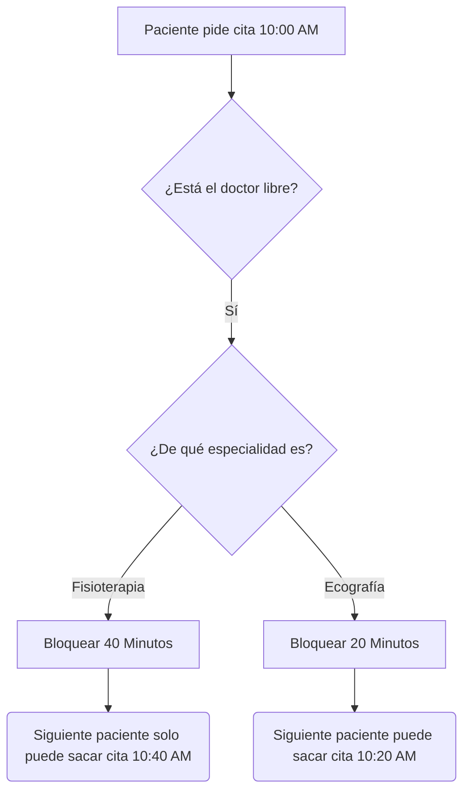
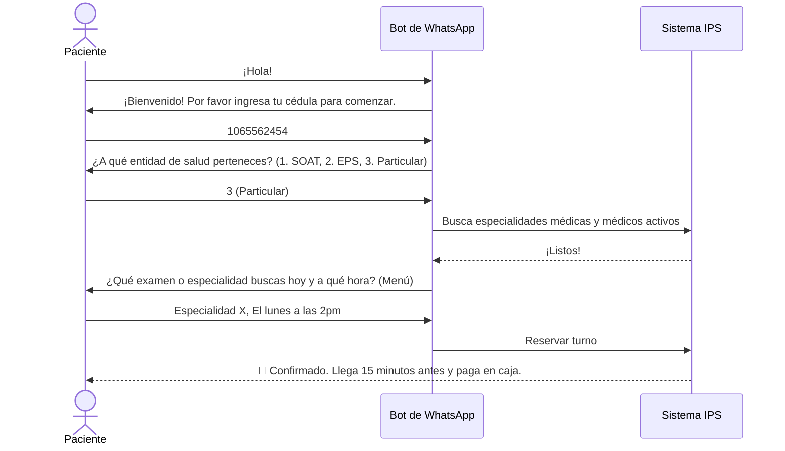

# Manual de Usuario Integral - Sistema de Gestión IPS 🏥

Bienvenido al manual operativo de su nueva plataforma médica. Este documento ha sido diseñado para explicar, paso a paso y sin tecnicismos, cómo funciona su clínica digital. 

El sistema cuenta con dos partes principales trabajando en perfecta sincronía:
1. **El Panel de Control Web:** Donde su personal (recepcionistas, médicos y administradores) organizarán el día a día.
2. **El Asistente de WhatsApp:** Un robot que atiende a los pacientes 24/7 de manera automatizada para reservar citas.

---

## 1. Módulos y Perfiles de la Clínica (Panel de Control)

Para mantener la seguridad y privacidad, cada persona de su equipo tendrá un "usuario" con accesos limitados según su rol en la clínica.

### 👤 Perfil: Administrador General
Es el "Director" del sistema. Tiene la llave para ver y modificar absolutamente todo.
* **Lo que puede hacer:**
  * Crear nuevas especialidades médicas (Ej. Cardiología, Fisioterapia).
  * Asignar cuánto dura normalmente una cita de cada especialidad (Ej. 20 minutos, 40 minutos) y escoger un color para identificarlas rápidamente en el calendario.
  * Crear los perfiles de los Doctores y Recepcionistas, dándoles su contraseña de ingreso.
  * Definir en qué días, qué horas y en qué sedes trabaja cada médico (Configuración de Agendas).
  * Ver el informe general de la clínica (pacientes atendidos, citas canceladas, etc.).

### 👩‍💻 Perfil: Recepción / Ventanilla
Es el filtro de entrada en la clínica física. Ideal para las personas que atienden a los pacientes en persona.
* **Lo que puede hacer:**
  * Ver el Gran Calendario del día con todas las citas de todos los médicos.
  * Buscar a un paciente específico en la base de datos si llega al mostrador.
  * Marcar a un paciente como "Llegó a la clínica" o "No asistió".
  * Revisar los documentos requeridos (Órdenes, comprobantes de pago, ARL) antes de decirle al paciente que pase al consultorio.

### 🩺 Perfil: Médico / Especialista
Pensado para la privacidad total. El doctor solo tiene ojos para sus propios pacientes.
* **Lo que puede hacer:**
  * Ver exclusivamente su propio calendario de citas.
  * Ver el resumen de por qué viene el paciente (notas dejadas por la recepcionista o el bot).
  * No pueden mover sus propios horarios base ni borrar especialidades; para eso deben hablar con el Administrador.

---

## 2. ¿Cómo funciona el Calendario Inteligente? 📅

El corazón visual de la plataforma es el Gran Calendario. No es un calendario normal, es un calendario **preventivo de choques**.

**Características Especiales del Calendario:**
1. **Duración Automática:** Si "Fisioterapia" dura 40 minutos y un paciente se agenda a las 10:00 AM, el sistema **bloquea** toda esa franja. Nadie más podrá agendar a las 10:20 AM. Las franjas se estiran solas según la necesidad.
2. **Colores de Especialidad:** En un solo vistazo rápido a la pantalla, la Recepcionista sabrá qué va a pasar. Si ve muchas cajas "Azules", sabe que es un día pesado de Ecografías. Si ve "Verdes", es día de Terapias físicas.
3. **Mueve Citas Arrastrando:** Puede hacer clic en una cita, mantenerla presionada y arrastrarla a otra hora, todo es súper interactivo.

---

## 3. El Asistente de WhatsApp Automático 📱

Usted no necesita que una recepcionista esté contestando el teléfono todo el día para agendar citas. Su número de WhatsApp de la clínica contará con un robot asistente.

El bot es un programa conversacional configurado con "menús guiados". Cuando un paciente le escribe *"Hola"* al WhatsApp de la clínica, el bot sigue estas reglas estrictas para atenderlo en tiempo récord:

### 🌟 Flujos de Auto-Atención del Bot

#### A. Flujo para Sacar una Cita Nueva
El paciente obedece los menús numéricos del Bot:

**Diferenciador por Entidades:**
* **Para SOAT / ARL / Prepagada:** El bot es estricto. Le recordará al usuario que sin un *Número de Autorización*, la clínica no lo atenderá, o que debe llevar fotocopias obligatorias a la clínica el día de la consulta.
* **Para Particulares:** Le indicará al usuario exactamente cuánto es el costo estimado de la especialidad para que lleve ese dinero en efectivo/tarjeta a la clínica el día de la cita. 

#### B. Modificaciones y Cancelaciones Automáticas
El paciente tiene control remoto sobre sus turnos, esto minimiza las inasistencias ("No-shows"):
1. **"Deseo cancelar mi cita"**: El bot buscará qué citas tiene ese número celular. Se las mostrará y le preguntará mediante números cuál quiere borrar. Al confirmar, el espacio del calendario del Doctor queda en blanco automáticamente para que se ofrezca a otro cliente.
2. **"Deseo reprogramar"**: El paciente elige su cita actual y el sistema le muestra solo los días de los próximos meses donde el doctor vuelve a tener huecos libres, guiándolo a elegir nueva fecha y nueva hora en 3 simples pasos de teclado.

#### C. Control de Recordatorios y Mensajes Push de la Clínica
El sistema nunca dejará que el paciente lo olvide:
* **Recordatorio 1 hora antes:** Faltando apenas 60 minutos para que inicie su cita, la base de datos se activa sola y le dispara un mensaje automático a WhatsApp: *"¡Oye! Acuérdate que tienes cita a las XY con el Doctor Tal"*.
* **Reprogramaciones Administrativas:** Si, en el panel administrativo, la secretaria aplaza una cita de mañana para el día viernes, a ese paciente le vibrará el celular con un WhatsApp en ese mismo segundo que le dirá: *"Aviso de Reprogramación: La clínica ha movido tu cita de Fisioterapia para el día Viernes..."*

---

## 4. Nuevo Módulo Destacado: "Laboratorios" en Vivo 🧪

Si un paciente necesita hacerse un examen clínico que fue ordenado en un papel con letra de médico, ahora es más fácil que nunca:

1. **Subida por el Paciente:** Puede enviar desde WhatsApp su receta médica a modo de Foto (`.JPG` o `.PNG`).
2. **Recepción Mágica:** En el panel de control web, el administrador entra a la pestaña "Laboratorios" y esa foto enviada por WhatsApp en Colombia, aparecerá instantáneamente en la nube web lista para abrir, revisar, mandar la orden al radiólogo por otro lado y aprobarle su proceso.

---

### Resumen de Ventajas para la Clínica
1. **Adiós a los Cuadernos:** Citas ordenadas, rastreables y coloreadas en PC y Tablet.
2. **Ahorro en Personal de Call Center:** El grueso de las citas lo agenda la máquina.
3. **Disminución de Citas Perdidas (No-Shows):** Como cuesta segundos que el paciente la cancele por WhatsApp cuando sabe que no va a ir, usted logrará revender esa franja horaria a alguien más. Además, los avisos 1 hora antas aseguran puntualidad de la clientela.
